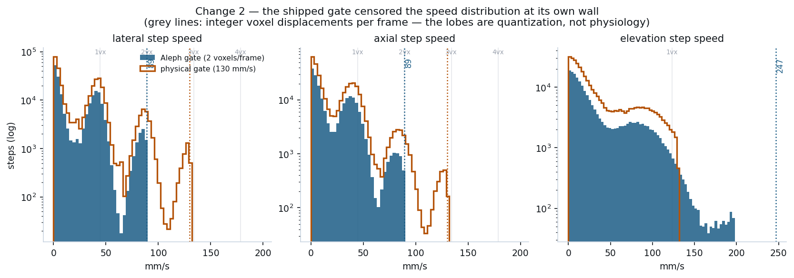
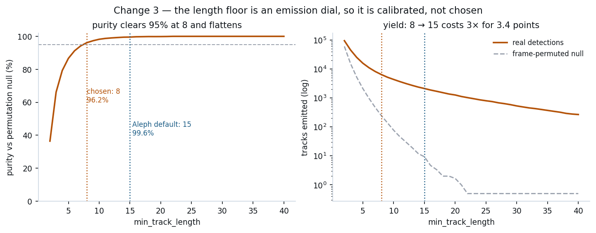
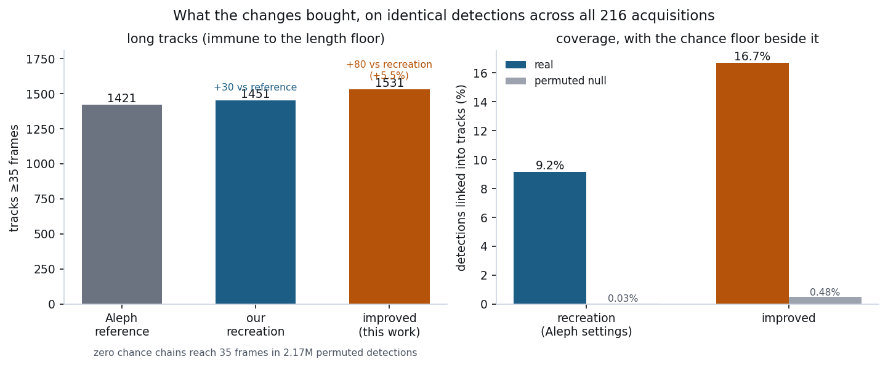

# From the Aleph baseline to our improved pipeline: every discrete change

What we started with is the shipped `alephneuro/microbubbles` pipeline, run unmodified with its
own settings. What we ship now differs from it in **three** places. This document lists all of
them, what evidence forced each one, what it cost, and — equally important — the changes we
measured and **rejected**, so the ledger is not just a list of wins.

Everything below is measured on all 216 acquisitions of the corrected public dataset, on
identical detections, with our baseline arm reproducing the reference recreation exactly
(7,296 tracks / 1,451 ≥35 / 582 ≥50).

---

## Change 0 — the input (a precondition, not a pipeline change)

Upstream replaced the public sample on 2026-07-11 (commit `23c49e57`), same URL, same filename.
The earlier export came from a **single-row acquisition** with no elevation extent; beamforming
it to 25 planes produced ±y mirror-symmetric warps, and in their words its detections "would not
link into 3D tracks". Our 98 GB copy was that retracted export: 223 acquisitions × ~700 frames,
5 transmit angles, 1 receive row. The corrected file is **216 × 240, 4 angles, 8 rows**.

This is listed first because nothing else here is meaningful without it, and because it retired
a long list of open bugs that were never our bugs: the 240-vs-700 frame puzzle, the elevation
midplane pile-up, the detection flood (7% of frames holding 68% of detections), 3–4×
over-tracking, and a documented "conflict" with the maintainers over 4 vs 5 transmit angles.

**Effect:** the shipped pipeline on the corrected data reproduces the reference to 1.02×
(1,451 vs 1,421 tracks ≥35). That recreation is the baseline for everything below.

---

## Change 1 — deterministic, phase-invariant SVD clutter filtering

**What.** The temporal SVD's eigendecomposition runs in complex128 (accumulated as a chunked
Gram so no double copy of the full matrix is materialised), and the per-mode score is the
phase-invariant `|fft(u)|²` folded onto `|f|` rather than `|rfft(u.real)|²`.

**Why.** A Hermitian eigensolver fixes each eigenvector only up to a unit phase, so scoring the
real part measures the LAPACK representative rather than the data. Measured: a phase re-draw
moved the shipped score by up to **17.5 Hz per mode**; the invariant score by **0.000 Hz**. In
complex64 the same code was non-deterministic run-to-run.

**Effect.** Run-to-run detection agreement on one acquisition: **93.8% → 99.998%** (1 differing
detection in 43,040). It also *changes* the detection field — 38,282 → 43,039 detections
(+12%) on identical input — because complex64 was over-suppressing the retained blood subspace.

**Status.** Both halves are now **upstream** as well (PR #4 and PR #5), arrived at
independently; their measurements agree with ours (they report 15.6 Hz where we measured 17.5).
This is the one change that is no longer a difference between us and them.

---

## Change 2 — the tracking gate, in physical units and anisotropic

**What.** The shipped gate is a box of 2 voxels/frame. Replaced with **130 / 130 / 130 mm/s**
(lateral / elevation / axial) via the existing `max_dist_mms` path — no new code.

**Why.** 2 voxels/frame is 89 mm/s in-plane but **247 mm/s in elevation** — 2.77× looser on the
axis with the worst localization (0.5547 mm voxels synthesized from 8 physical rows, against
0.2 mm in-plane). And it was binding: per-step velocities across the 216-acquisition recreation
hard-wall at exactly the default, observed 89.2 / 246.7 / 89.3 against 89.15 / 246.76 / 89.33
predicted — three significant figures on all three axes, with zero steps above 92 mm/s in-plane.
The speed distribution everyone had been quoting was an artifact of our own gate, and every
bubble faster than ~89 mm/s in-plane was structurally unlinkable.

**Read the figure carefully.** The lobes at 0, ~45, ~90 mm/s are **integer voxel displacements
per frame** (1 voxel/frame = 44.6 mm/s in-plane, 123.4 in elevation), not physiological modes —
sub-voxel localization is not smoothing them out. The blue distribution stops dead at 2 voxels;
the orange one reaches the third lobe. In elevation the change is a *tightening*, which is why
the orange curve is cut short there.

**A coincidence that cost real time.** The gate wall and the 4-angle coherent-compounding null
are the same speed by algebra: voxel = λ/4 so 2 voxels/frame = λ·FR/2, and PRF = 4·FR so
λ·PRF/8 = λ·FR/2 = 88.97 mm/s. Gate-censoring and compounding-annihilation are therefore
confounded in every track-level statistic and separate only by axis. That is why the axial
deficit this program chased could not be attributed from track data alone.

**Effect.** +80 tracks ≥35 frames (1,451 → 1,531) and the bulk of the coverage gain below.

---

## Change 3 — the length floor, calibrated against a null

**What.** `min_track_length` 15 → **8**.

**Why it is not simply "loosen a knob".** The floor is applied *only at emission*
(`tracking.py:343`, `:722`, `:729`) — it never enters the assignment cost, the Kalman update,
the gate, or spawn logic. Lowering it recovers **zero** associations; it decides what gets
published. So it should be calibrated, not argued about. Against a frame-permutation null
(same detections, trajectories destroyed) purity is 36.5% at length 2 — two-point chains are
half noise — clears **95% at 8**, and reaches 99.6% at 15. Going 8 → 15 costs 3× the yield to
buy 3.4 points, and the shipped 15 buys no planted-crossing precision (flat 0.91–0.96 across the
whole range).

**Effect.** 3.1× more published trajectories (7,296 → 22,685) and linked detections 9.16% →
16.7%, at 95.2% purity. Tracks ≥35 are unaffected by construction.

**The two changes interact.** At floor 15 only 1.2% of the gate's link gain is
null-reproducible; at 8 it is 11.8%; at 5 it is 28.6%. A gate gain quoted without its floor is
not a meaningful number, which is why they are reported together.

---

## Non-change — the clutter rank and normalization, confirmed rather than assumed

`rank 24 + spatial_tgc` survived a joint sweep against synthetic injections at matched
false-alarm rate. Worth recording *why* rank 24 is defensible: the adaptive cutoff never fires
on this data (no mode centroid reaches the 100 Hz boundary; max 85–96 Hz), so rank 24 is the
10%-of-frames fallback — accidental, and also correct. The win in that sweep was
**normalization**, not rank; on one acquisition the data-driven knee resolves to exactly 24, the
status quo filter.

---

## What we measured and rejected

| candidate | verdict | evidence |
|---|---|---|
| Elevation grating lobes (pitch is 2.08λ) | **refuted** | 1.93× excess at the predicted offset, but 6 of 27 *arbitrary* offsets beat it; apex wanders across depth where a real lobe is fixed |
| Motion-phase hypothesis bank / compounding null | **refuted at modelled strength** | the modelled notch predicts a lateral:axial ratio of 169 in the top speed band where real data shows 1.53; it would leave the data axially extinct |
| 888 Hz interleaved per-transmit movie | **abandoned** | the four steered volumes are mutually decorrelated in the raw field |
| Marchenko-Pastur high cutoff | **harmful** | removes 122 of 240 modes (correct maths, wrong regime: γ = 240/1.06M collapses the bulk to a point); costs 0.09–0.14 recovery |
| B18 spatial-correlation cutoff | **harmful** | returns 2 modes |
| `per_elev_zband` normalization | **rejected** | changes sign between acquisitions (+0.018 / −0.014) |
| Injector's slow-lateral blind spot as a real-data claim | **rejected** | propagated through tracking it predicts a ratio of 0.01–0.04 where real data says 0.98 |

Two of our own results were also withdrawn: a coherence "refutation" that turned out to measure
tissue clutter rather than bubbles (it evaluated the ratio on the raw pre-SVD field, where
clutter sits 25–40 dB above the signal), and a "1.348× vs reference" figure produced by a
harness that called `kalman_tracking_3d` directly and silently inherited its `max_cost=1e5`
default instead of production's `10.0`.

---

## Net effect

| | Aleph reference | our recreation | improved |
|---|---|---|---|
| tracks ≥35 frames | 1,421 | 1,451 | **1,531** |
| tracks ≥50 frames | — | 582 | **601** |
| tracks (native floor) | 50,456 (floor 5) | 7,296 (floor 15) | 22,685 (floor 8) |
| tracks at matched floor 15 | 7,274 | 7,296 | **7,808** |
| linked detections | — | 9.16% | **16.7%** |
| purity vs permutation null | never measured | 99.5% | **95.2%** |
| run-to-run reproducibility | 93.8% | 99.998% | 99.998% |

**Zero chance chains reach 35 frames** in 2.17M permuted detections, at either operating point,
so the headline population is null-free and the +80 is not bought with contamination.

## Honest scope

This is a **publication-and-association** improvement: more of the trajectories the pipeline
already builds, with the chance-chain fraction measured rather than assumed, plus a determinism
fix that is now upstream anyway. It is **not** more signal extracted from the raw data. Every
upstream idea that promised that is in the rejected table above.

One upstream lever remains live and unproven: per-angle coherence declines ~2.3 dB across the
measured speed range (post-SVD median 0.85, against 0.50 for random phase — so the detections
are *not* speckle, and the compound is buying real gain). That curve currently bins by a
velocity derived from the same phasors as the quantity being binned, so it needs re-binning
against independently tracked step velocity before it can be claimed. The per-detection export
for that test is already on the Modal volume.
